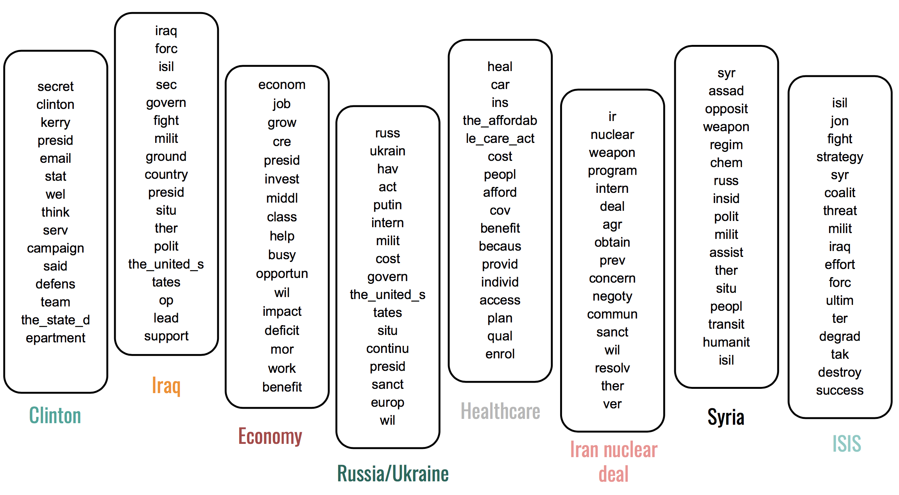
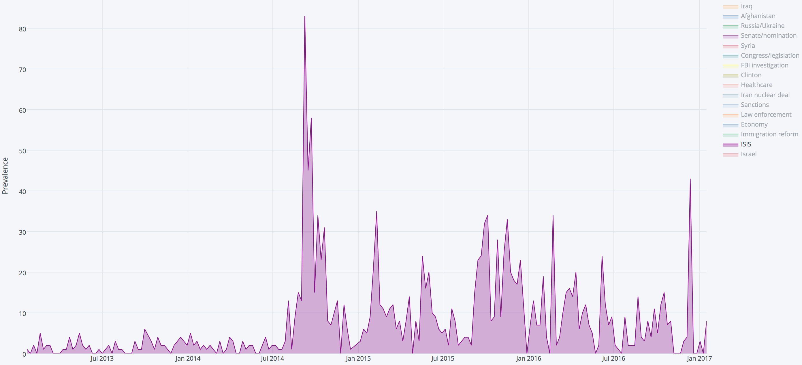

The goal of this project was to distill topics from press briefing topics and visualize how they ebbed and flowed over time. The resulting timelines reflect administration priorities as well as external events that came to dominate the narrative. I scraped all the press briefings from the Obama years from the whitehouse.gov archives and used natural language processing to perform the topic modeling.

<strong>Cluster topics</strong> 

<strong>Visualizing the rise of ISIS in the White House narrative</strong> 

-----
**Languages**: Python  
**Libraries**: nltk, sklearn, gensim, spacy, plotly, BeautifulSoup  
**Methods**: Natural language processing (TFIDF, SVD), clustering  

Replication notes:

- `0.0_fletcher_scraping.ipynb` scrapes press briefings from the Obama years
- `1.0_fletcher_analysis_limited_data.ipynb` tries different ways of topic modeling on a subset of the data (5000 documents)
- `1.1_fletcher_full_data_lsa_kmeans_80_clusters.ipynb` runs an LSI with 200 dimensions and kmeans with 80 clusters on the full dataset (Obama's second term, ~125,000 documents)
- `2.0_plotly_80_clusters.ipynb` plots the topics over time in plotly
- `fletcher_presentation_EM.pdf` includes my slides

The interactive visualization of topic timelines is available here: https://plot.ly/~ejm714/25.embed
